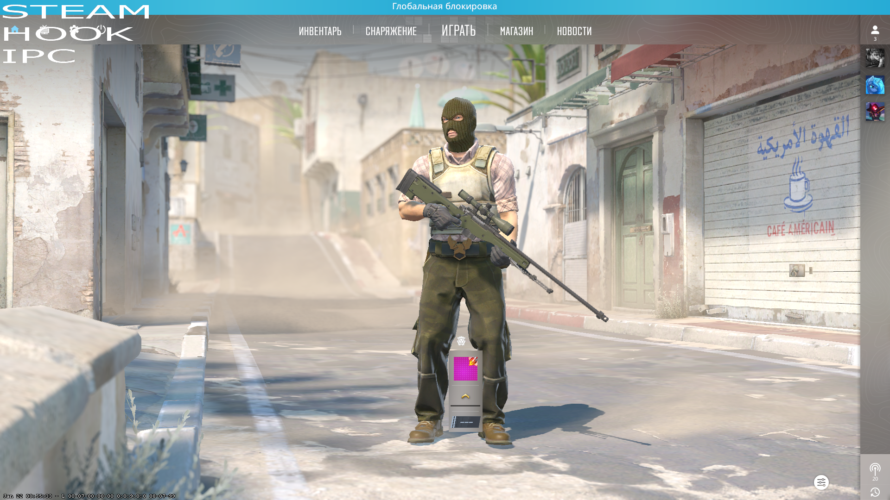

This C++ program communicates with a game process ("cs2.exe") using shared memory for rendering commands. It draws a textured rectangle and periodically loads a texture into the game's rendering system. The main loop ensures continuous interaction with the game process.
